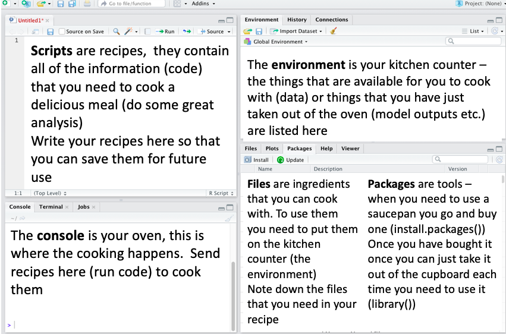

```{r setup, include=FALSE}
knitr::opts_chunk$set(echo = TRUE)
```

```{r, echo = FALSE, message=FALSE, warning= FALSE}
library(bio2020)
```

## Aims and objectives of Practical 1
The overall aim of this practical is to help you become more familiar with RStudio, what its main panels are for, and some basic summary statistics and visualisations. The specific objectives are to:

1. explain the concept of RStudio projects to allow you to store data, files containing R commands (known as scripts), and the 4 main panels in RStudio
2. demonstrate the value of .csv files (comma separated files) as these can be read / written by both R and Microsoft Excel, and the functions to do this.
3. understand free R packages to extend the power of R. How to install and load packages for use.
4. how to calculate simple summary statistics of the data you have imported into R
5. create of some simple summary plots to aid interpretation
6. show you how these graphs and tables of calculated statistics can be exported to Microsoft Word and Microsoft Excel

We will primarily focus on two datasets: 
* `Chick_Diet.csv` This contains the final weights of chicks after 21 days on four different diets.
* `Chick_growth.csv` This shows the average growth rate on each day of all the chicks from day 0 (hatching) to day 21.

This practical assumes you are using RStudio rather than the older RGui interface to R. The RGui interface is, however, **much simpler** and some students prefer to use it instead. The main difference is that you typically write your R scripts in Notepad (or TextEdit on an Apple Mac) and copy-and-paste the R commands into the RGui. If you would prefer to use the RGui please ask myself or one of the demonstrators. I have added some notes about using the simpler RGui in the Appendix at the end of the Practical 1 schedule.

## 1. RStudio projects and the RStudio screen
### 1.1 What is a project and how to create one
RStudio projects provide a simple method of ensuring that all your files are settings for a particular piece of work are collected together. I generally create a separate RStudio project for each experiment or survey that I am involved in. It allows me to keep my data, analytical commands and results organised together. We are going to start by creating a Project called 'BIO2020' to keep all of our work relating to the 'BIO2020' course together in one place.

Start by opening up R Studio on your computer. 
To create a new project click on the main menu on  `File` > `New Project`  
You should now see this popup window, on which you should select **New directory** 

```{r, echo = FALSE}
knitr::include_graphics("http://www.rstudio.com/images/docs/projects_new.png")
```

then a **Project Type** window like the following should appear, from which you should select **New Project**:


Finally, the following window, entitled **Create New Project** should appear:


In this window complete two sections:

* The **Directory name**. This is the name of the folder to store your R scripts and data for your work. For convenience, call it **BIO2020** as shown above.
* The section **Create project as subdirectory of:** Click on the **Browser** button and navigate to **Documents** or **My Documents**. The exact title will differ depending on your PC or MacBook setup. This wants to be where you normally store all your folders and files. Do **NOT** have this set as "Downloads" or similar. On my own PC, the "My Documents" area has a "shortcut" name of **~** which you can see displayed above. The setup might be slightly different on your PC.

Finally, click on the **Create project** button at the bottom and you should now see the name of your project displayed in the top right hand side of your R Studio window. 

**NOTE** If you have already created a BIO2020 folder in your _My Documents_ area, you can create a new project in an "Existing Directory" from the first menu option instead.

#### 1.1.1 How to start RStudio in future
Once you have created a project, all you need to do in is **double-click on the R Project file**. This will automatically start RStudio in the right place, with the correct working folder etc. Here is what it looks like for me:


This is setup for the first practical. Things to note:

* There is a `Data` folder (see below on how to create) in which I will store all my data files
* I have started to write a "script" (simple text file) called `Practical_1.R`, in which I can save a record of my R commands for future use (see below on how to create)
* The R project is stored in **This PC -> Documents -> BIO2020** , not in a Downloads or Temporary folder.

Depending on your configuration, your PC or MacBook may not display the full filenames, or date or type, so the screen might look like:


#### 1.1.1.2 Create a Data folder and a "Script"
It is good practice to create a folder called **Data** in which to store all the datasets you plan to analyse. Open either **File Explorer** (Windows) or **Finder** (MacBook), navigate to your BIO2020 folder, and create a folder in it called **Data**. You can also do this from within RStudio by clicking on the **New Folder** button on the Files tab on the bottom right panel.

An R "script" is simply a plain text file that contains all your R commands. By "plain text" we mean the simplest possible format: it does not have any fancy bold or italics etc. like a Microsoft Word document, and can be opened by any editor. The big advantage of storing the R commands in a script is that you can re-use them later, write "comments" in them to help you remember what the commands are doing, so that they are a practical resource for you in future.

To create a new `script` to store all of the code for today's practical, in the top left click `File` > `New file` > `R script`
Click on the save icon `r emo::ji("floppy_disk")` to save this script and give it a meaningful name eg. `Practical_1.R`

Depending on your system, your RStudio window will roughly look like this:


### 1.2 Understanding the components of the RStudio screen

* **Top left** This is the new empty 'script' file `Practical_1.R` that you have just created. You can use this to store your R commands for later re-use. You can put comments after a `#` sign to help remind you what the commands do.
* **Top right** This has several tabs, but the one shown above is the 'Environment' which will show the names of tables of data, the names of results of analyses etc. As you have not done anything yet, it is empty. Another useful tab is called 'History' which contains a record of the R commands you have issued.
* **Bottom right** Again, several tabs. You will often use the 'Plots' and 'Help' tabs. Shown above is the 'Files' tab which shows the `BIO2020.Rproj` file which contains all your settings (colours, font size, zoom level etc.) and your `Practical_1.R` which is also displayed in the top left panel.
* **Bottom left** This is headed 'Console'. You can enter R commands directly into the Console. You can also copy R commands from your `Practical_1.R` script into the Console for re-use. It is this ability to store a set of R commands in a simple script for re-use that is so valuable. 


### 1.3 Cookery with RStudio?
Some people find a cooking analogy useful to help understand the different components of the RStudio screen!

```{r, fig.align='center', echo = FALSE}

```

### 1.4 Running R commands

You might notice that in the online interactive website tutorials that you completed on your own we ran R code by clicking on a big green run code button, when we are working in RStudio it's a little bit different. 

You write your R commands in your script which means you can save it and repeat the exact analysis weeks or months later. This is known as **reproducible research**. Later in this practical, there are a couple of ways to *run* the R and you can choose whichever feels best for you. 

1. Highlight the R commands in the script that you want to run and then press the `run` button that is available at the top of the script

2. Place your cursor anywhere on a line in your R script that you want to run and press <kbd>Ctrl</kbd> + <kbd>Return</kbd> (<kbd>Cmd</kbd> + <kbd>Return</kbd> on Apple Mac) together

Either of these actions sends your R commands to the console where it is executed so that R carries out the instructions.

### 1.5 Typical R workflow
Here is a common workflow you might find yourself doing

1. Design, plan your experiment or field survey
2. Undertake your experiment and collect your data
3. Enter your data into Microsoft Excel
4. Save your data from Excel into CSV (comma separated value) format which can be read by any software
5. Open your R Project, and start an R script, into which you can save R commands
6. Import your data from CSV file into R
7. Initial summary statistics and basic plots
8. More advanced analyses
9. Export any graphs or tables from R to Microsoft Word and/or Excel
10. Remember to save your R script before you exit RStudio

## 2. Importing data from an external csv file into RStudio
### 2.1 What are csv files?
Comma Separated Format (.csv) files are very useful. Tables of data can be entered into Microsoft Excel, then exported via Excel's **File -> Save As** menu. These .csv files can then be imported into R/RStudio for sophisticated analyses. Likewise, you can export tables of results from R/RStudio back to Excel as .csv format.

For this practical we will be using the following data files:

 + Chick_Diet.csv
 + Chick_growth.csv

Find these 2 files on Canvas and download them to your computer. By default they will probably end up in your `Downloads` folder. **Please copy both .csv files to the `Data` folder you created in Section 1 of this practical**. To use these files we need to import them into R and store each one in R's memory as an "object". An object in R can be a table of raw data, results of analysis, a graph saved for later use. Open the two .csv files in Microsoft Excel to have a quick look at them. (**Note:** Excel might complain that you have not saved the files when you try to close Excel, as Bill Gates gets upset if you do not use his proprietary file format. Ignore the warning.)

* `Chick_Diet.csv`  contains the variables weight, Time, Chick and Diet. It contains the weights of 45 individual chicks after a 21 day time period on 4 diets; A, B, C and D.
* `Chick_growth.csv` contains the variables Weight (note that this one is with a capital W), Time and Diet. It contains the average weight of all the chicks on each day of the experiment, from day 0 (hatching) to day 21, for each of the same 4 diets.

### 2.2 Where to type your R commands
We are now going to show you how to import the data from your .csv files into RStudio and temporarily store them as R "objects" called `diet_dat` and `growth_dat` using the `read.csv()` function. Please write your R comands in the script `Practical_1.R` (top left panel of RStudio). You can save and re-run the script later. You do not actually need to save the temporary R objects `diet_dat` and `growth_dat` as you can re-create them within seconds from your R script. **In contrast, it is always important to save your script before you close R/RStudio**.

The `read.csv()` function takes a single "argument" to tell R the name of the .csv you are importing. This is the full "path" to the .csv file, therefore since your .csv files are in a `Data` folder you also need to include the word `Data` in the argument, as well as the name of the .csv file. **Important** R is "case-sensitive", so if you put `chick_diet.csv`, `Chick_diet.csv` or `chick_Diet.CSV` etc. you will get an error that R cannot find the file. 

Type the next three lines into the top of your `Practical_1.R` script in the top-left panel of RStudio:

```{r}
# Introduction to R. Basic data handling

diet_dat <- read.csv("Data/Chick_Diet.csv") # Read in diet data
```

A few points about the above 3 lines of code

* The first line contains the `#` sign. This tells R to ignore the rest of the line. This is a "comment" and is probably the most important single command you will ever use. I put comments throughout my R scripts, so that when I re-use them months later I understand what they are doing. I generally use the first line to remind myself what the script is going to do.
* The second line is blank. Students tend to be poor at including blank line(s). However, it is a good idea to group a set of related R commands together, and then separate them with one or two blank lines, in the same way that you use paragraphs when writing an essay to structure the text.
* The third line contains an R function called `read.csv()` which imports the `Chick_Diet.csv` file into the R environment. It takes a single 'argument' in double-quotation marks, namely where the csv file is stored and its name. Note that it also includes the name of the `Data` folder where you stored the .csv file
* The third line contains the `<-` symbol that points into `diet_dat`. This means "assign the output the `read.csv()` function into the R table of data called `diet_dat`". If you look at the top-right window of you should notice that the "Environment" tab is no longer empty, but now contains the `diet_dat` table. Tables of data in R are usually known as "data frames" and you will see this term pop up several times in this course.
* Finally, the third line also contains a comment, but at the end of the line, after the R commands.

<!-- Note for demonstrator, if they have trouble reading in the data file check where the script file is saved, if it's in a sub-folder of the project the code specifying the file path will need to escape that sub-folder first using ../ so they need  read.csv("../Data/Chick_Diet.csv")-->

### 2.3 Check the data that you have loaded
After you have imported data into RStudio it is useful to look at the first few rows, understand its structure, check the names of variables (columns) etc. Some suggested functions are `head()` `str()` `summary()` `nrow()` `ncol()` `names()`. Use these functions to answer the following questions about the data

 1. What are the names of the columns in the `diet_dat` data frame?
 2. How many variables (columns) and how many observations (rows) are in the dataset? 
 3. How heavy is the heaviest chicken? And is this the same in both of the datasets?

**Reminder** Make sure to comment your script, using the `#` write some comments (notes) to annotate the script that you have just written so that you know what all the lines do, e.g.

```{r, eval = FALSE, echo= TRUE}
# reading in the Chick_Diet data file 
diet_dat <- read.csv("Data/Chick_Diet.csv")

# Display the first few lines of the data
head(diet_dat)
# Inspect the structure of the data
str(diet_dat)
# Try the nrow(), ncol() and summary() functions
```

Repeat the process with the `Chick_growth.csv` file:

```{r, eval = TRUE, echo=TRUE}
# reading in the Chick_Diet data file 
growth_dat <- read.csv("Data/Chick_growth.csv")

# Display the first few lines of the data with the head() function
# Try the nrow(), ncol() and summary() functions
```
 
```{r, eval = TRUE, echo=FALSE}
# ensure both datasets available later 
growth_dat <- read.csv("Data/Chick_growth.csv")
diet_dat <- read.csv("Data/Chick_Diet.csv")
```


## 3. R Packages
### 3.1 What is an R package
One of the reasons why R is so popular amongst scientists is that its basic functionality can be readily extended by packages. Anyone can write one, and they are made publically available free of charge. Packages exist for bioinformatics, animal tracking, habitat analysis, species distributions, phylogenetics. There are over 10,000 free packages available.

### 3.2 Installing packages
You can install a package even if you do not have Administrator rights for a PC using the `install.packages()` function. **This only has to be used once to install a package**. If you have not already done so, please follow the instructions at [Getting Started](https://ncl.instructure.com/courses/23926/pages/the-bio2020-r-package) to install several packages including:

* `mosaic`, which gives a unified interface for statistics. This also automatically installs several other packages such as `ggformula` which simplifies plotting, `tidyr` for manipulating data etc.
* `vegan`, which handles large compositional datasets, of the sort that might be obtained from molecular / bioinformatics studies, as well as species assemblage data for plants, birds, mammals etc.
* `car`, this is useful to clarify analyses if you have any missing data
* `bio2020`. I have written this package (which is why the installation method was slightly different). It gives easier to understand graphics and commands for the `vegan` package, and automatically loads all the other packages you need.

### 3.3 Activating packages
To use the new functions in a package you need to activate it or "load" it. This has to be done once in **every** R/RStudio, using the `library()` function. The best practice is to put the `library()` function near the start of your script, so you do not forget about it. The little `bio2020` package I have written should (hopefully!) automatically load all the other packages you need for this course, to make things easier. Put the following line near the start of your `Practical_1.R` script and run it.

```{r, echo=TRUE, eval=FALSE}
library(bio2020)
```

You should see a message welcoming you to the package, and you have access to the extra functions in `mosaic`, `ggformula`, `tidyr`, `vegan`, `car` and several other packages automatically. I recommend that you put the line `library(bio2020)` near the start of all your R scripts.

## 4. Summary statistics
### 4.1 Goal-oriented approach
Please have a look at the [Course Handbook](https://ncl.instructure.com/courses/23926/files/3203623?fd_cookie_set=1) on the Canvas website. You will see there that we are using a goal-oriented approach, where your goal can be a simple statistic, a data analysis or a graph. Let us start with some simple statistics on the `diet_dat` data.

We can calculate some summary statistics to see if there are differences between chicks being fed different diets. Calculate the mean weights for chicks being fed different diets.

Remember we are using the formula 

$$\text{simple statistic(variable ~ group, data=dataset, ...)}$$

Where:

+ **simple statistic** = This is our "goal", the statistic that we want to calculate (mean, median, sd, etc.)
+ **variable** = the name of the column containing the response variable. (Optional, but in practice nearly always used)
+ **group** = the name of the column containing a categorical explanatory variable by which we want to group the data
+ **dataset** = the table of data (data frame) you are using
+ **...** = options. Rarely used for simple statistics

For each group we can calculate statistics such as the mean and median

```{r}
mean(weight~Diet, data = diet_dat)
median(weight~Diet, data = diet_dat)
```

The above two lines print the mean and median on the screen. If you do not remember the difference between means and medians, have a look at [Measures of Central Tendancy](https://naturalandenvironmentalscience.shinyapps.io/variation/#section-measures-of-central-tendency). You can also save the results of your mean and median in temporary variables `chick_mean` and `chick_med` for later re-use:

```{r, echo = TRUE}
# Save means in temporary variable called chick_mean
chick_mean <- mean(weight~Diet, data = diet_dat)
# Save medians in temporary variable called chick_med
chick_med <- median(weight~Diet, data = diet_dat)
```

Both median, and especially mean, can be sensitive to outliers: see the interactive on the above website. To get a good understanding of our data we need to calculate some statistics that give us an idea of how our data is **spread** about the mean. If this is unfamiliar to you go back over other sections of the interactive website tutorial linked above.

Thankfully because we are doing our analysis in R we don't have to calculate measures such as variance, standard deviation and standard error by hand, we can use functions to help us.

### 4.2 Calculate the variance and standard deviation for each diet
This is straightforward, using the functions `var()` and `sd()`

```{r}
# calculate variance for each group
var(weight~Diet, data = diet_dat)
# calculating standard deviation for each group
sd(weight~Diet, data = diet_dat)
```

As before, rather than merely displaying these values on screen, we can put them into temporary R "objects" called  `chick_var` and `chick_sd` and assign the output of the `var()` and `sd()` functions to those objects.

```{r}
# calcualating variance for each group
chick_var <- var(weight~Diet, data = diet_dat)
#calculating standard deviation for each group
chick_sd <- sd(weight~Diet, data = diet_dat)
```

### 4.3 Calculate standard error
Remember that we also discussed Standard Error as a useful measure that can be calculated as:

$$se = \frac{\sigma}{\sqrt{n}}$$

We have already calculated the variance but for the calculation of se we need to know n, the number of observations in our group.
Again there is no need to count the number of observations in each group by hand, lets use the `favstats()` function which also computes some other useful measures that we might be interested in. The name `favstats()` refers to "favorite statistics"!

First, we store the results of all the commonly used statistics using `favstats()` in a temporary R object, which we'll call `fav_dat`:

```{r}
#creating favstats table
fav_dat <- favstats(weight~Diet, data = diet_dat)
# inspect the contents of fav_dat
fav_dat
```

The results of your `favstats()` function are stored in a data frame with several columns. We can access single columns using the `$` sign. The column headed `n` contains the number of observations, and you need this in order to convert standard deviations into standard errors. **We can access the values in a single column of a table (data frame) using the `$` symbol**. Here we want to access the column `n` which contains the number of chicks in each diet. To calculate se we want R to use `fav_dat$n` in our calculation, we can substitute this as well as the values that we already calculated for sd `chick_sd` into the equation

```{r}
chick_se <- chick_sd/(sqrt(fav_dat$n))
```

**Note:** It is important to modify your `Practical_1.R` script as you go along, adding additional comments using `#` symbols, so that if you come back after 6 months you will still understand the R script. Add some notes about the above commands as comments to demonstrate that you understand what each bit is doing.

### 4.4 Assembling all the summary statistics into a new table 
We have created summary statistics with mean, median, variance, standard deviation and standard error. It would be useful to put them all into one table, or data frame. This is easy to do using the (you guessed it!) `data.frame()` function:

 + `chick_mean`
 + `chick_med`
 + `chick_var`
 + `chick_sd`
 + `chick_se`

```{r}
diet_stats <- data.frame(chick_mean,
                         chick_med,
                         chick_var,
                         chick_sd,
                         chick_se)
diet_stats
```


Now you have a data frame that contains summary statistics describing your dataset that might be useful in a report. 

## 5. Basic summary plots
### 5.1 Goal-oriented philosophy
We can use exactly the same goal-oriented philsophy when developing graphs as with basic statistic described above. For example, if you want to plot one variable against another:

$$\text{plot type(variable y} \sim \text{variable x, data= dataset, ...)}$$

+ **Plot type** = This is your "goal", in other words a graph.
+ **Variable y** = (optional) The value to be plotted on the vertical y-axis, usually your "response" variable
+ **Variable x** = Value plotted on horizontal axis, usually your "explanatory" variable, either categorical or continuous
+ **Dataset** = Typically a table (data frame)
+ **...** = Options to control colours, groupings etc.

Here your y-variable is plotted on the vertical axis, and your x-variable on the horizontal axis. There may also be times when you only want to plot **one** variable, for example a frequency histogram, or a count of the number of observations. In this case the pattern is as follows, with the `variable` plotted on the horizontal axis, and the vertical axis (e.g. frequency or count) calculated automatically:

$$\text{plot type(} \sim \text{variable, data=dataset)}$$


Because we are using the `ggformula` package the plotting functions that we will use will be preceded by `gf_` (graphics formula) so for a boxplot we will use `gf_boxplot()` for a bar chart we use `gf_bar()`, for scatter points `gf_point()` etc. There are links to additional information about `ggformula` on the Canvas website. Plot types you are likely to find particularly useful include:

* `gf_point()` Scatter plot
* `gf_line()`  Line plot
* `gf_histogram()` Frequency histogram
* `gf_bar()` Bar charts
* `gf_boxplot()` Boxplot
* `gf_violin()` Violin plots
* `gf_line()` Line plots

You can also overlay plotting elements on top of each other, change colours, axis titles, add legends etc.

### 5.2 One variable. Simple bar chart
Here we want to create a simple bar chart showing the number of chicks in each of the four diets on day 21 (`diet_dat`). You may have noticed that there are not quite the same number of chicks present after 21 days in each diet. We don't need to work out the count, as this will be calculated automatically by `gf_bar()` when you only give it one variable: 

```{r, eval = TRUE}
gf_bar(~Diet, data = diet_dat)
```

That was simple, but the graph is a bit dull, and the axis labels could be improved. Let's get rid of the grey background and add some colours too. Note in the following code how we can "chain" one graphics command into the next using the **"pipe" `%>%` symbol**. When you see this, think of the English word "then":

```{r, echo = TRUE}
gf_bar(~Diet, fill= ~Diet, data = diet_dat) %>% 
  gf_labs( y = "Number of chicks (n)", x = "Experimental Diet") %>% 
  gf_theme(theme_minimal())
```

The main changes in the above code were to:

 + add a `fill=` argument to the plot to colour the bars by diet
 + use the `gf_labs()` function to change the label of the Y axis
 + use the `gf_theme()` function to change the background
 
Remember you use the pipe symbol `%>%` to join multiple `gf_` functions together.

The above commands uses the default colour scheme, but you may prefer to select your own using the `gf_refine()` and `scale_fill_manual()` functions to change the colours to four of your favorites. There are many colours to choose from which can be found online. [Here is an awesome list of over 650 colours to select](https://www.datanovia.com/en/blog/awesome-list-of-657-r-color-names/). **Note** below extra comments are added to the R script so that you can understand it in future (or refer back to it later on in this practical)


```{r, eval = TRUE}
# creating the bar chart 
gf_bar(~Diet, fill= ~Diet, data = diet_dat) %>%  # THEN
  gf_labs( y = "Number of Chicks (n)", x = "Experimental Diet") %>%     #change axis labels
  gf_theme(theme_minimal()) %>%      #change the theme
  gf_refine(scale_fill_manual(values = c("blue", "red", "yellow", "green"))) # select some colours
```

Have a go at modifying the code to try different colours or different axis labels.

### 5.3 Plot two variables; categorical horizontal axis
#### 5.3.1 Boxplots
A boxplot is a very useful summary. It provides the median (horizontal line), a box with the inter-quartile range (75% of the data fall within the box), lines representing 1.5 * the inter-quartile range, and (sometimes) outlier points. It provides a simple yet effective way of summarising the spread of your data, showing where most of the values fall, whether it is skewed etc.

Let us create a boxplot to show chick weight after 21 days on the four different diets, again using the `diet_dat` dataset. We now need two variables, i.e. the y-axis (vertical axis) "response" variable of chick weight:

```{r}
gf_boxplot(weight~Diet, data = diet_dat)
```

At the moment the axis labels are just `weight` and `Diet`. Try changing them into something more meaningful, for example the vertical axis to say "Weight (g)" as you should always include units where possible.

#### 5.3.2 Violin plots
Violin plots have become a popular alternative to boxplots in the last 5 years. You can easily do this. Let's also overlay the points, change the y-axis label, and set the colours. In other words, we are going to:

1. Alter the plot type from boxplot to violin plot
2. Add data points that are shaped according to the diet the `gf_sina()` function will be useful
3. Modify the labels so that the units (g) are displayed with the weight
4. Modify the theme and colours to match the bar plot you previously made

You might notice that the arguments `fill` and `colour` do slightly different things depending on the geometry (the violin or the points) that you are dealing with, play around with them to see what the differences are.

You should end up with a plot that looks like the one below

```{r}
gf_violin(weight~Diet, colour = ~Diet, fill= ~Diet, alpha = 0.3, data = diet_dat) %>%       # THEN
  gf_sina(shape = ~Diet, colour= ~Diet) %>%      #add points THEN
  gf_labs(y = "Weight (g)") %>%                  #change the labels THEN
  gf_theme(theme_minimal()) %>%                  #set theme THEN
  gf_refine(scale_colour_manual(values = c("blue", "red", "orange", "green"))) %>%
  gf_refine(scale_fill_manual(values = c("blue", "red", "orange", "green")))
```


### 5.4 Plot two variables; continuous horizontal axis
In the previous example the horizontal axis was divided into discrete categories. Often your horizontal axis will be continuous, and line or point plots will be most useful. Let's begin by plotting your chick growth data with `growth_dat` day from day 0 (hatching) to day 21 on the horizontal axis, and weight on the vertical axis:

```{r}
gf_point(Weight~Time, data=growth_dat)
```

The problem with this graph is that it does not indicate that we actually have four different diets. So let's colour the points accordingly:

```{r}
gf_point(Weight~Time, colour = ~Diet, data=growth_dat)
```

Finally, let's join up the points with lines:

```{r}
gf_point(Weight~Time, colour = ~Diet, data=growth_dat) %>%
  gf_line()
```

Use the skills that you have just been practicing to modify the plot so that it has the same overall appearance (colours and theme) as the previous plots. See if you can create something similar to the following:

```{r,echo= FALSE}
growth_dat <- read.csv("Data/Chick_growth.csv")
 gf_line(Weight~Time, colour = ~Diet, data = growth_dat) %>% # THEN
   gf_point() %>% 
  gf_labs(x = "Day",y = "Weight (g)") %>% # change the labels THEN
  gf_theme(theme_minimal()) %>% # change the theme to a simple one THEN
  gf_refine(scale_colour_manual(values = c("blue", "red", "orange", "green"))) # set colours
```

Later in the BIO2020 course you will learn how to create fitted lines from models to add to your graphs.

## 6. Export data and plots from R/RStudio to Word or Excel
### 6.1 Exporting tables of data
After you have created some summary data and plots that describe the dataset you may to export them to be able to put them in a report.

First, recall `diet_stats` table of summary statistics (a "data frame") that you created earlier. This contains the mean, median, variance, standard deviation and standard error of chick weights. Data frames can be exported by writing a file with the `write.csv()` function, which does the reverse of the `read.csv()` function you used earlier.

The arguments of the `write.csv()` function are the name of the `object` that you want to export and the `filepath` including the file name of the data file that you want to create. 

```{r, eval = FALSE}
# note that the file path specifies that the file should be created in the Data folder
write.csv(diet_stats, "Data/Chick_summary.csv")
```

You should now see the `Chick_summary.csv` file that you have just created in your File Explorer, you can open the file in Excel and use this to create a table that you can import into a Microsoft Word document. 

### 6.2 Exporting plots
Plots can be saved from the RStudio plots pane.
Use the arrows to navigate through the plots to find the ones that you want to save such as the bar chart of number of chicks in each category, the violin plot of chick weights and the plot of chick growth through time. 
For each plot that you want to save click `Export` then `save as image` in the preview pane you can alter the size of the plot and name the file that you want to create.

Finally open a Word document and insert the plots and summary table giving each a descriptive caption. Write a short paragraph that describes how the different diets in the study impact the growth of chickens, referring to your figures and tables. 

## Before you exit RStudio
Make sure you save `Practical_1.R`  When you exit RStudio it will probably prompt you to save the "Workspace" and the "History". Click "No" to these (personally I find these prompts irritating and confusing). The key thing to save is the script of R commands. If you have **not** saved it there will be a small `*` symbol next to its name.

# Appendix
## Getting help
I have put some useful guides to online books on the Canvas website, but there are some excellent online tutorials available, including [Coding Club](https://ourcodingclub.github.io/) which has been written by students for students. It does cover lots of advanced stuff (I don't understand it all) as well as the basics of R.

R has its own built in help for functions. These are difficult to understand at first, but as the format is identical in every case they slowly become less daunting. To access the in-built help, put a `?` symbol into the console, followed by the name of the function. For example, in the R package `bio2020` I have written a function called `ordi_identify()` which you will learn how to use in Practical 5. If you wanted to view its help, you would type:

```{r, eval=FALSE}
?ordi_identify
```

## Using the traditional RGui
The main differences are:

* There are no projects. You therefore "manually" have to tell R the name of the folder in which you are working, by clicking on **'File -> Change dir...`** and navigate to the BIO2020 folder
* Create your R script in Notepad (or TextEdit) and copy-and-paste code into the Console
* Plots will appear in pop-up windows. Right-click on the pop-up window to save the graph to a file for use in Word.
* Help for individual R functions will appear in your browser, Chrome (Windows) or Safari (Apple Mac)
