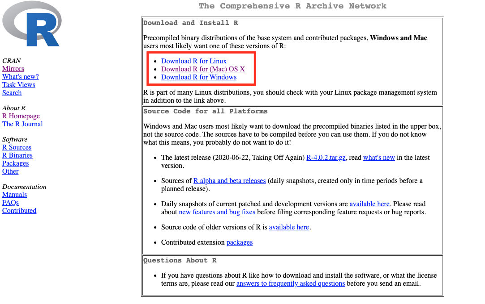
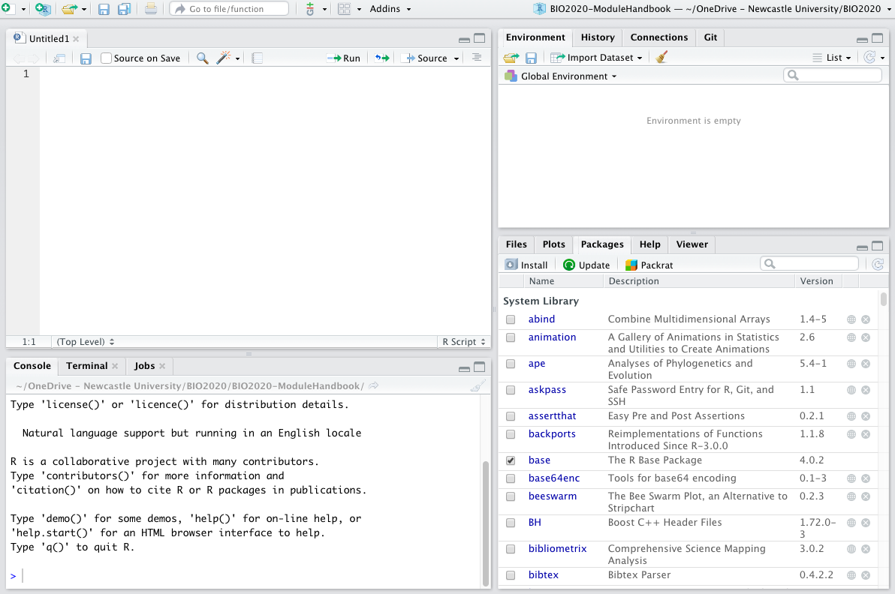
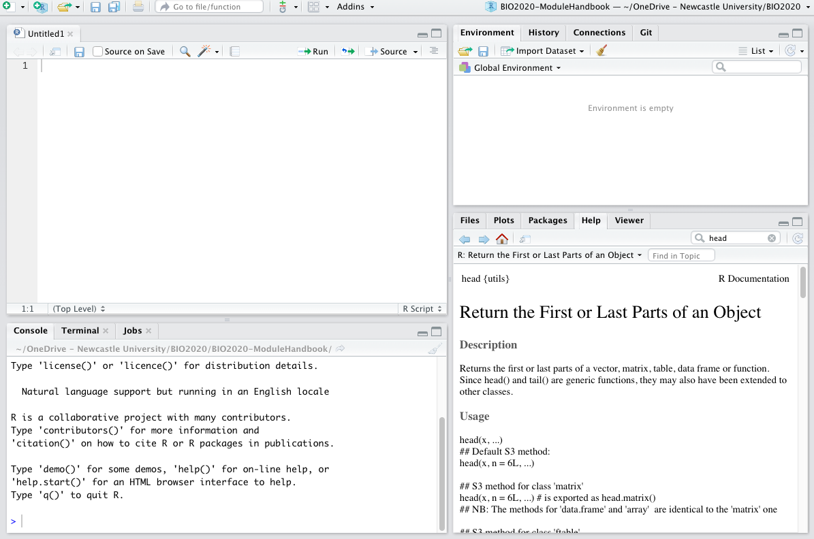
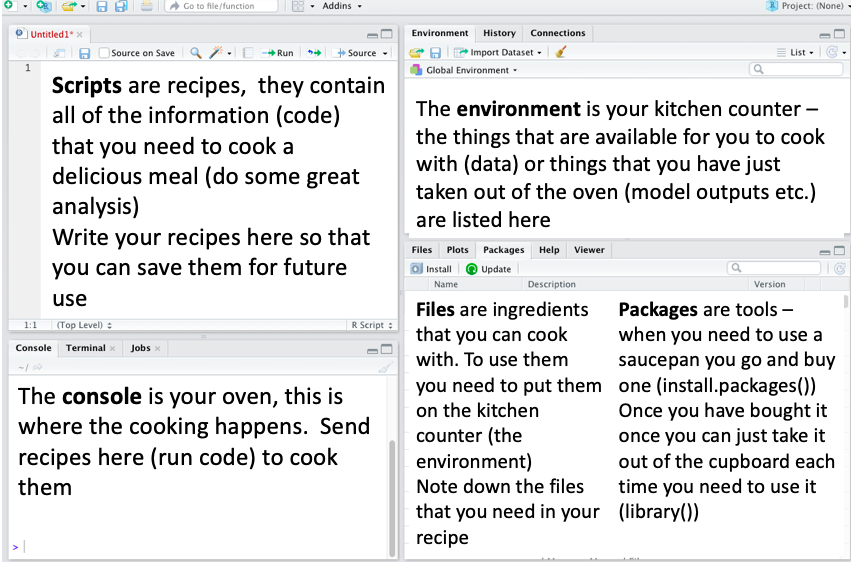
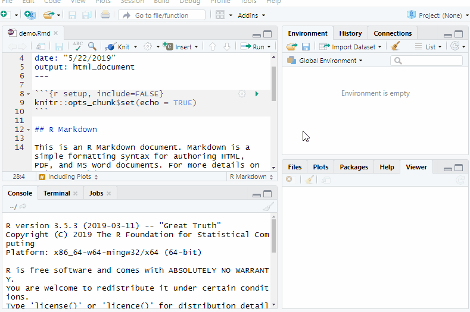
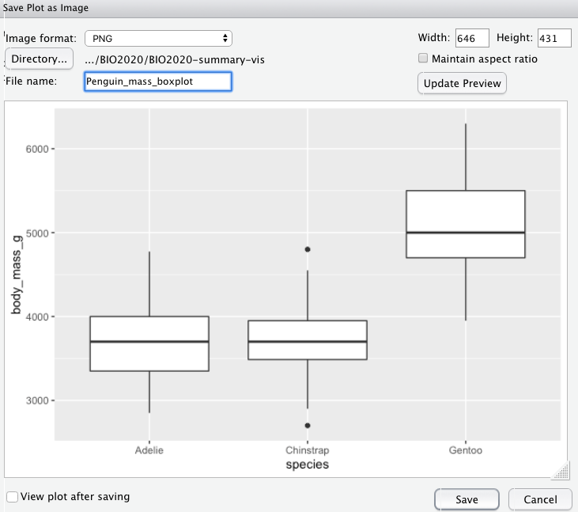
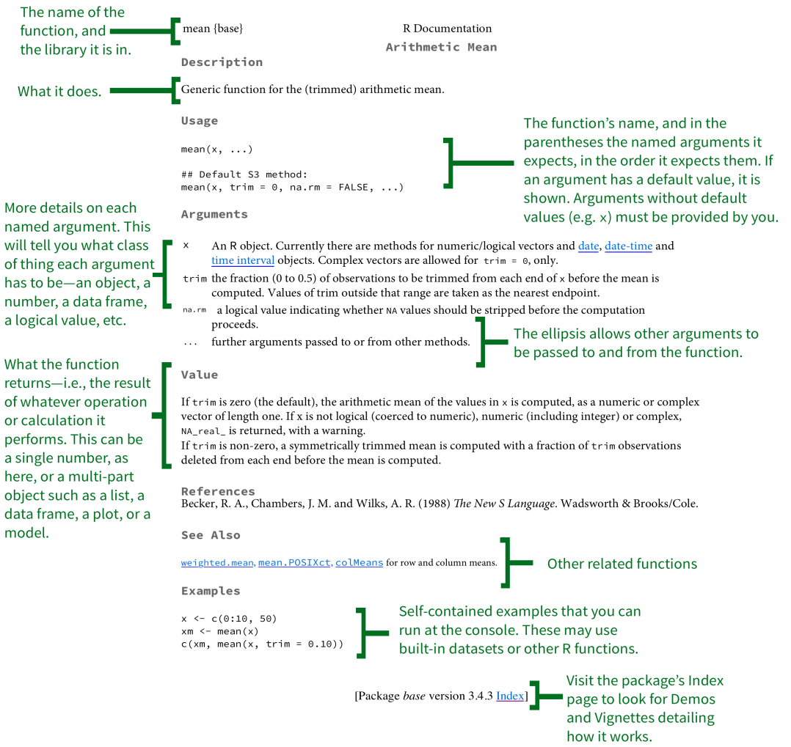
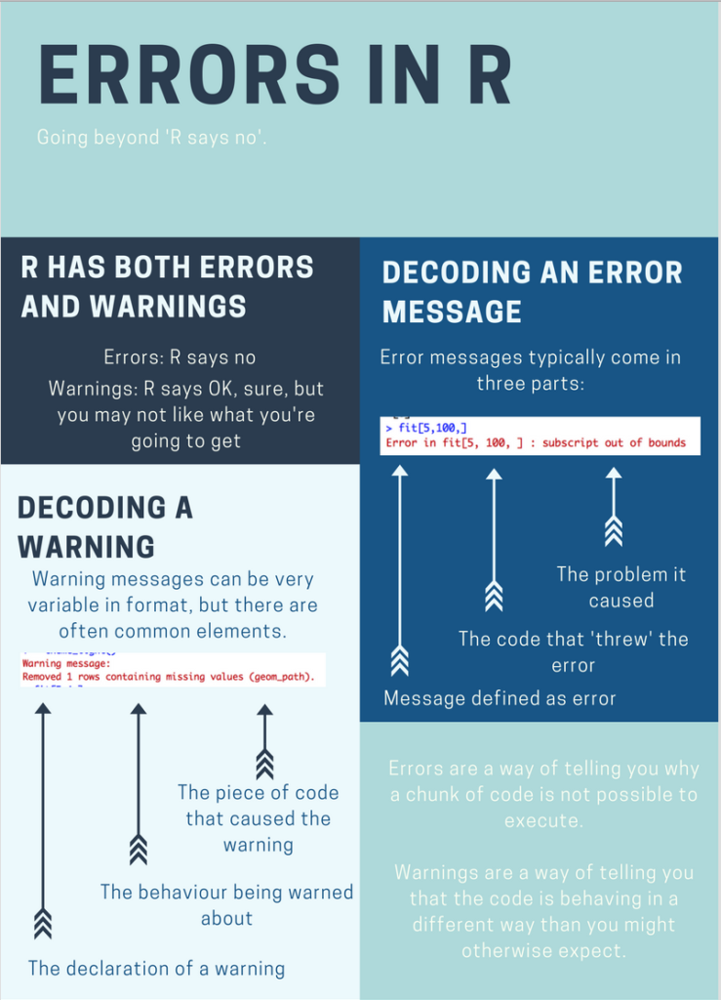
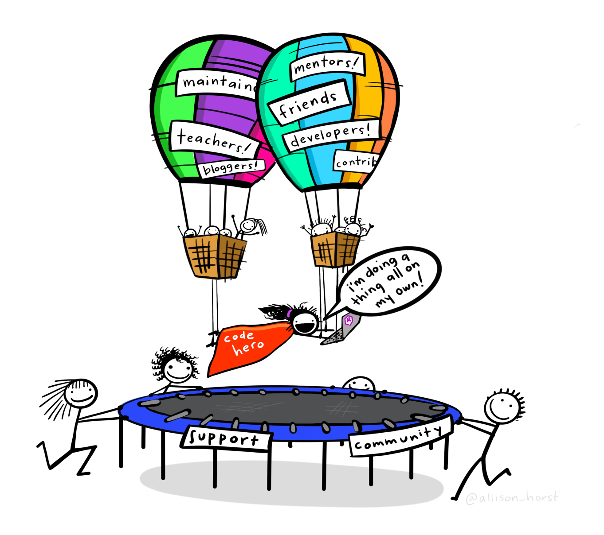

```{r setup, include=FALSE, warning = FALSE, message = FALSE}
knitr::opts_chunk$set(echo = TRUE)
library(learnr)
library(dplyr)
library(flextable)
```

## R and R Studio installation

This module is an introduction to using the R software through the R Studio interface.
R is both a computer software and a programming language that can be used for powerful data analysis and will be used across several of the taught modules that you will undertake.

Campus computers have the software installed and when working from home/off campus you can access it through the windows virtual desktop [WVD Client](https://services.ncl.ac.uk/itservice/core-services/software/wvd/#accesswvd).
R and R Studio are free software that you can download and run on your computer (it is compatible with Windows, Mac and Linux).
To get set up with the software on your machine follow these  steps

1. You can [download the R software](https://cran.r-project.org/) by selecting your operating system and downloading the latest release.

```{r r-download, width=8, echo = FALSE}



```


2. [Download the R Studio desktop software](https://rstudio.com/products/rstudio/#rstudio-desktop) Choosing the free open source edition.

```{r rstudio-download, width=8, echo= FALSE}

knitr::include_graphics("images/Rstudio-download-ref.png")

```

Once both R and R Studio have been downloaded and installed on your machine you can get to work

## Navigating R Studio

On opening R Studio you should see something like this

```{r, echo = FALSE}
knitr::include_graphics("images/Rstudiofresh.png")
```

In the top left click `file` > `new file` > `R script` and now you should have four windows that look something like this:

```{r, echo = FALSE}


```


You should now have Four panes in your R Studio window, you might notice that some of them have multiple tabs as well. Let's run through the meaning of each of the panes, and the tabs that we are going to be using:

### Scripts
 The pane in the **top left** contains your scripts, scripts are files that contain code, most often you will be working with files that have the .R extension, these are files that your computer recognizes as containing R code. 
One of the key reasons that R is so popular is because it allows us to make our work reproducible.
By writing down each bit of our analysis and saving it in a script we can reproduce our work with ease. 
Future you will thank past you for saving your code in scripts when you are making last minute edits to your dissertation and you need to remember exactly what the analysis methods you used were!

### Environment
 The pane in the **top right** has a couple of tabs but the one that we need to know about is the Environment tab.
The Environment pane tells us what objects R has loaded in to its memory (we'll touch on this a bit more later on), these might be data files that we have imported or the results of some analyses. 
This pane shows us the objects that R has available for doing useful stuff.

### Console
The pane in the **bottom left** also has several tabs and the one that we use is called the console.
This pane is the 'doing pane' when we want to run bits of code that we have saved in our script we send them to the console to be executed - which means R does what our code tells it to do and we get some output.
You might see people typing code directly in to the console and while this is possible we **strongly advise against doing this**, it is much better to write your code in a script that you can save and come back to for future reference.

### Files/Plots/Packages

**Bottom right pane** has several tabs that give the pane different functions that can be of use. 

The ***Files*** tab can be used  a bit like windows explorer/finder to navigate through the files on your computer.
```{r, fig.cap = " Here the files tab shows us that within the folder that we are working in there are several different files associated with the module handbook as well as a folder of images", echo = FALSE}
knitr::include_graphics("images/Rstudio4files.png")
```

The ***Plots*** tab is where the plots that you create using the code written in your script will appear. 
It has an export button that you can use to save your plots or to copy them to your clipboard so that you can then insert them into documents or presentations.

The ***Packages*** tab shows you the packages that are installed on your computer, the ones with ticks in the boxes are ones that are loaded and ready for you to use.
Packages are collections of code and/or data that other people have written that we can use.
Packages mostly contain bits of code called *functions* which we will cover in a bit more depth in the 'working with data' section.
R comes with several packages installed already but often we will want to use extra packages.
To do this we must first download the package from the internet and install it on our computer.
We only need to install the package once.
Next time we want to use the package we will see that it is listed in our packages tab and we load it for use.

```{r, fig.cap="You can see here that there are several packages that are installed with the R software and some pacages like the base package are already loaded and ready to use", echo = FALSE}

```

```{r, message =FALSE, warning= FALSE, echo = FALSE}

p <- paste("When working through tutorials you might find examples of functions being noted to belong to a package. eg. we're going to use the `mean` function (", emo::ji("package"),"mosaic). The package is noted for reference, a common error that we see is students trying to use a fnumction without remembering to first load the package that it belongs to. This casues R to return an error, checking that the correct package is loaded is usually the first thing that we do when trying to resolve an error like this. Students often ask how do you remember which functions to use? and which functions are in each package? the answer is that it is experience, the more you come to use R the more of the code you remember.
The good news is that you don't necessarily need to memorise which package a particular function belongs to but knowing can help with troubleshooting issues,which is why we reference them here for you. 
 ")
p <- as.data.frame(p)
names(p) <- paste("A note on packages", emo::ji("package"))

#big_border = fp_border(color="#9cdce6", width = 2)


myft <- flextable(p) %>% 
 bg(., bg = "#9cdce6", part = "header") %>% 
bg(bg = "#9cdce6", part = "body") %>% 
align(align = "left", part = "all") %>% 
  bold(part = "header") %>% 
  fontsize(part= "all", size = 12) %>% 
set_table_properties(width = 1, layout = "autofit") %>% 
border_remove()
myft
```


<!-- A note on packages `r emo::ji("package")`  -->

<!-- When working through tutorials you might find examples of functions being noted to belong to a package. eg. we're going to use the `read_csv` function (`r emo::ji("package")`  readr) -->


The ***Help*** tab offers you an interactive window through which you can use the help files for R functions.
You can use the search bar at the top of the pane to search for the help files associated with a given package or function. 
We will cover the help files in more detail once we have got a bit more of an understanding of some of the R lingo

```{r, echo = FALSE}

```


#### Think of R as your Kitchen

Using R can be thought of similar to using a kitchen to cook.

```{r, fig.align='center', echo = FALSE}

```

There are loads of really great chefs (coders) in the world who have already figured out a lot of techniques and gadgets that can be used to make some great food.

```{r, fig.align='center', echo = FALSE}

```

You don't always have to cook everything from scratch - you can use the information and tools that other people have provided to make your cooking experience easier and more enjoyable 


FYI: you can change the default location of the panes, among many other things: [Customizing R Studio](https://support.rstudio.com/hc/en-us/articles/200549016-Customizing-RStudio)

If you are moving panes about and you accidentally lose one don't worry, it can easily be recovered
```{r, echo = FALSE, fig.width=8}

```


## Working with data

As mentioned before R is a programming language, as with any language there is some vocab that needs to be covered in order to help your understanding of what is being described.

Here we will run through the terms:

 - value
 - assign
 - object
 - comments
 - functions
 - arguments
 
Then we will go on to talk about data types and structures that we use in R.
 
### Creating Objects

You can get R to return a *value* by giving it some simple maths
```{r maths, echo = TRUE}
6*7
```

But to do useful and interesting things with that *value* we need to *assign* it to an *object* so that R remembers it.
To do this we first need to come up with a name for our *object*, then we use  the assignment operator which looks like this `<-` to *assign* our *value *to the *object*:

```{r object, echo = TRUE}
my_height <- 175
```

`<-` is used to *assign* the *value* 175 to the *object* `my_height`

In R Studio, typing <kbd>Alt</kbd> + <kbd>-</kbd> (push <kbd>Alt</kbd> at the same time as the <kbd>-</kbd> key) will write ` <- ` in a single keystroke.

#### Object names 

Objects can be given any name, good object names are explicit (in providing some information about the object) and are not too long.

There are some names that cannot be used because they are the names of fundamental functions in R (e.g.,`if`, `else`, `for`, see [here](https://stat.ethz.ch/R-manual/R-devel/library/base/html/Reserved.html) for a complete list). 
In general, even if it's allowed, it's best to not use other function names (e.g., `c`, `T`, `mean`, `data`, `df`, `weights`). 
If in doubt, check the help to see if the name is already in use. 
It's also best to avoid dots (`.`) within names so use an underscore (`_`) if you need.

**Objects vs. variables**
What are known as `objects` in `R` are known as `variables` in many other programming languages. However, in this lesson, the two words are used synonymously. For more information see:
https://cran.r-project.org/doc/manuals/r-release/R-lang.html#Objects

The *objects* that we create are stored in the Environment (remember that top right pane)
To see what has been assigned to an object you can send the name of the object to the console. 

```{r my-height}

my_height

```

We can update the *value* that is assigned to the *object* `my_height` by overwriting the current value.
Update the value of `my_height` so that it has the value of **Your** height in cm and then press the green button to run the code.

```{r your-height, exercise=TRUE, exercise.completion=FALSE}
my_height <- 175 
# check the new value
my_height
 
```

Now that you have stored your height in the `my_height` *object* we can do some arithmatic with it.
Run the below code to convert your height from cm to inches

```{r your-height-in, exercise=TRUE, exercise.completion=FALSE}
my_height/2.54
 
```

What do you think is the current *value* of `my_height`? Check below 

```{r your-height-check, exercise=TRUE, exercise.completion=FALSE}

 
```
<div id="your-height-check-hint">
**Hint** Remember that to get R to display the *value* of an *object* you need to give it the object name (my_height)
</div>

You will notice that the *value* of `my_height` is still in cm, why? 
Because we didn't store your height in inches as an object, let's do that now

```{r your-height-inch, exercise=TRUE, exercise.completion=FALSE}
# create a new object
my_height_inch <- my_height/2.54

# check the value of the object 
my_height_inch
 
```

> ### Comments
>The comment character in R is `#`, anything to the right of a `#` in a script will be ignored by R. 
It is very useful to leave notes and explanations in your scripts, we highly recommend that you get into the habit of commenting your code as it will help you to remember what you have done AND it will help us to help you if you encounter problems. 
R Studio makes it easy to comment or uncomment a paragraph: after selecting the lines you  want to comment, press at the same time on your keyboard <kbd>Ctrl</kbd> + <kbd>Shift</kbd> + <kbd>C</kbd>. If you only want to comment out one line, you can put the cursor at any location of that line (i.e. no need to select the whole line), then press <kbd>Ctrl</kbd> + <kbd>Shift</kbd> + <kbd>C</kbd>.

### Functions
Almost all or our R coding uses functions, which are essentially bits of code that have been written to do something.
 When we refer to functions we will generally do so following the convention `functionname()` the brackets are a giveaway that we are referring to a function.
Functions take *arguments*, the arguments (inputs) are specified within the brackets.
Lets use the function `sqrt()` as an example.
The argument to this function is a value (or an object that contains a value) for which we want to calculate the square root.
When we run a function it returns an output that is the square root of the input value.
```{r function1, exercise=TRUE, exercise.completion=FALSE}
#run the function on a number
 sqrt(10)
# run the function on an object that contains a numberic value
 sqrt(my_height)
```

The return ‘value’ of a function need not be numerical (like that of `sqrt()`), and it also does not need to be a single item: it can be a set of things, or even a dataset. 
We’ll see that when we read data files into R.
Arguments can be anything, not only numbers or filenames, but also other objects. 
We can check what arguments a function is expecting using the `args()` function. 
The argument to the `args()` function is the name of the function that we want information for, `args(functionname)` eg. `args(sqrt)`
Exactly what each argument means differs per function, and can be further investigated using the help files (Remember the help pane, bottom left) which we will explain further later on. 

### Data types
R can deal with many different types of data and where it recognizes differences in data it may treat it differently. 
It is helpful to understand the different types of data that you will most commonly encounter in R:

**Numeric**

Numeric data are numbers 
```{r, eval = FALSE}

1, 2, 3, 4.5, 6.78

```

**Character**

Character data contain non numeric characters and are most often words.
R understands character data to be everything enclosed within the quotation marks "".
```{r, eval= FALSE}
"Lion", "tiger", "bear"
```

When we use this type of data in R we have to remember the "" otherwise R will assume that we are referring to objects (that may not have been created) of the same name and it likely to return an error
 
**Logical**

R understands logical data as TRUE FALSE, different from character data so no "" required and note that it is case sensitive.

```{r eval = FALSE}

TRUE, FALSE

```

```{r, message =FALSE, warning= FALSE, echo = FALSE}

p <- "R is case sensitive, we created an object called `my_height`, if we were to ask R for the value of the object `My_height` with a capital M we would see R return an error (unless we also have a variable called My_height stored in our environment)"
p <- as.data.frame(p)
names(p) <- "Case sensitivity in R"

#big_border = fp_border(color="#9cdce6", width = 2)


myft <- flextable(p) %>% 
 bg(., bg = "#9cdce6", part = "header") %>% 
bg(bg = "#9cdce6", part = "body") %>% 
align(align = "left", part = "all") %>% 
  bold(part = "header") %>% 
  fontsize(part= "all", size = 12) %>% 
set_table_properties(width = 1, layout = "autofit") %>% 
border_remove()
myft
```


### Data structures

We have already learned how to *assign* a *value* to an *object* but to do more complicated things in R we often need to store more than one value in a single object. 

#### Vectors

A vector is the most common and basic data type in R, a vector is composed by a series of values, which can be either numbers or characters. We can assign a series of values to a vector using the `c()` function. For example we can create a vector of animal weights and assign it to a new object weight_kg

```{r}
weight_kg <- c(190, 310, 500)
```

We could also create a vector containing animal names

```{r}
animals <- c("lion", "tiger", "bear")
```

We can inspect the contents of a vector, using functions such as `length()` and `class()` by giving these functions the name of the vector that we want to inspect. 

Using `length()` and `class()`  inspect the vectors `weight_kg` and `animals` that we have just created to see if you can work out what these functions do

```{r vect-inspect, exercise=TRUE, exercise.completion=FALSE}

length()
class()
```

```{r vect-inspect-solution}

length(weight_kg)
class(weight_kg)

length(animals)
class(animals)

```

As we can see the above examples are vectors that contain a single data type, lets have a look at what happens when we have multiple data types.
We can use the `c()` function again to join the two vectors together

```{r}
animal_info <- c(animals, weight_kg)
```

As before have a go at using the `length()` and `class()` functions to inspect the vector

```{r vect-inspect2, exercise=TRUE, exercise.completion=FALSE}

length()
class()

```

R is telling us that our vector is a character vector but we know that we have got some numeric information in there.
R converts data to a single shared type within a vector, the numeric information is converted into character data. 
As soon as R detects character data in the vector it assumes that everything in that vector is character data.

We can extract information from a vector by *indexing*, using square brackets [] to specify the information that we want from the vector according to it's position. 
From using the `length()` function we know that the `animal_info` vector contains 6 bits of information. 
We could ask R to show us the 6th bit of information only
```{r}
animal_info[6]
```

or we could ask for multiple bits of information according to their position

```{r}
#asking for the infomation in the first 3 slots of the vector
# the : tells R to return everything FROM 1 to 3
animal_info[1:3]

# asking for the first and last bits of information
# here we use the c() function to ask for information
# in locations 1 AND 4
animal_info[c(1,4)]
```


#### Data frames

Another very common data structure in R is the Data frame, these may be more useful when we have different data types that we want to keep together. 

Rather than combining `animals` and `weight_kg` into a single vector we can convert them into a data frame.

```{r}
# create an object in which to store the data frame
animals_df <-data.frame(animals,weight_kg)

# look at the data frame
animals_df
```

We now have something that might look more familiar to those of us that are used to working with data in excel.

We can use the `str()` function to look at the structure of the data frame.
```{r}
str(animals_df)
```

From this we can see that the data frame has 3 observations (rows) and 2 variables(columns), one called animals which contains character data and one called weight_kg which contains numeric data. 

If we want to extract a specific column of a data frame we can do so using the `$` operator.

```{r}
animals_df$animals
```

Here we are telling R that from the `animmals_df` we want the column `$` that is called `animals`

To extract a specific value we can *index* it using the square brackets [] to specify the position by location using dataframe[rownumber,columnnumber]

```{r}
animals_df[1,2]
```

These operations can be useful when we are dealing with small data frames but often when we are working with data we have large datasets, perhaps contained in spreadsheets on your computer or downloaded from the net. Such information needs to be imported into R before we can start to interrogate the data frame. 

Remember the kitchen analogy - Data contained in a file on your computer is like an ingredient in your cupboard, to be able to use it you first need to put it on the kitchen counter, which means we need to import it in  to R and assign it to an object so that it appears in our environment pane.


## Projects `r emo::ji("file_cabinet")` 

<!-- When we are working on something in R it is good to keep all of the files associated with that work together in one place. -->
<!-- Not only is this good practice but it can help us to help you (if you get stuck) and can save you from having to work with unnecessarily long file paths which makes life easier. -->
<!-- What do we mean by the term 'file path'?  -->

Before we go through importing your data to R it is worth taking some time to consider how to make this process as painfree as possible.
To load information from files in to R we need to tell R exactly where on our computer that file is.
The file path is the information that denotes where on your computer a file is stored.
Often file paths are specific to your computer or to your username and might look something like this: 

```{r, eval = FALSE, echo = TRUE}

"C:/Users/Myusername/Documents/Uniwork/mydataforbio2020.xlsx"

```

This tells us that "mydata.xlsx" is in the `r emo::ji("file_folder")`Uniwork, which is in the `r emo::ji("file_folder")` Documents on my computer.

The file path for a specific file will almost always be different on different peoples computers (depending on which folder you saved a file in for example) and this can cause confusion when we are trying to run our code or asking a friend to check our code. 

We can minimise the issues with this by using the [Projects](https://support.rstudio.com/hc/en-us/articles/200526207-Using-Projects) option that is built in to R Studio.
When we create a Project R Studio will create a file with the extension `.Proj` which basically tells R to start looking for files from the folder that we are in. 

It is good practice to have a separate R Studio project for each project that you are working on so it would be a good idea to have a separate Project for each of the modules that you use R for and a project for your dissertation work.

#### Setting up a Project

To create a new project go to the projects menu, either by clicking the dropdown in the top right hand side of your window (next to where it says Project: (None)) or by clicking `File` > `New Project`  

You should now see this popup window: 

```{r, echo = FALSE}
knitr::include_graphics("http://www.rstudio.com/images/docs/projects_new.png")
```

Select `New directory`  then  `New Project`

Give your project a name (eg. the name of the module) and select where on your computer you want that to live.
Click `Create project` and you should now see the name of your project displayed in the top right hand side of your R Studio window. 

**NB** If you are an organised person and you had already created a folder for all of the work associated with a given module you can select `Existing Directory` navigate to your already existing folder and then select create project and the `.RProj` file will live in that folder alongside all your other files


When you work in a Project R knows to look within that project folder for any files that you want to access.
Now that you are working in a project the Files tab (bottom right window) will default to displaying the files that are in your project folder.

`r emo::ji("file_cabinet")` How you organise your files within the project folder is up to you, there are some good tips in this [guide](https://www.britishecologicalsociety.org/wp-content/uploads/2017/12/guide-to-reproducible-code.pdf) produced by the [British Ecological Society](https://www.britishecologicalsociety.org/)

We suggest that you have a couple of subfolders to keep you organised

 + `r emo::ji("file_folder")` Data, where all of your data files live
 + `r emo::ji("file_folder")`Analysis, where you can store all of your scripts
 
When working in a project you can access your data files using a shorter file path 

```{r, eval = FALSE, echo = TRUE}

"Data/mydataforbio2020.xlsx"

```
rather than 
```{r, eval = FALSE, echo = TRUE}

"C:/Users/Myusername/Documents/Uniwork/BIO2020/Data/mydataforbio2020.xlsx"

```


```{r, echo = FALSE}

```


## Importing and exporting data

To be able to analyse our data in R we first have to import/read it in to R so that it is available to us in our environment (Taking it out of the cupboard and placing it on the counter).
How we go about this varies slightly depending on the file that we are going to be using.
In all cases we need to assign the information in the file to an object so our code will start with the name of the object we are creating and the `<-` symbol

#### `r emo::ji("file_folder")`CSV

Often data are stored in a `.csv` file a specific file type that is commonly used, these files look just like excel files (you can open them up and look at them in excel) they are just read differently by the computer.

You can convert Excel spreadsheets to `.csv` files by saving them as such. 
When saving your file in excel select `file` > `save as` > `comma delimited (csv)` to save it as this file type.
You can then read it into R using the `read.csv()` function.

<!-- You will likely see two different ways of reading these files in to R using either the `read.csv()` function or the `read_csv()` function (`r emo::ji("package")` readr). -->
<!-- These functions essentially do the same thing (get your data in to R) but with some slight differences that we will address later on. -->

```{r, eval = FALSE, echo = TRUE}
my_data_object <- read.csv(path = "Path_to_the_file.csv")

```

<!-- #### `r emo::ji("file_folder")` Excel  -->

<!-- Using the `read_excel()` function (`r emo::ji("package")` reaxl) you can import information from excel files (`.xlsx` and `.xls`) containing multiple sheets.  -->
<!-- By default the function will read the information from the first sheet unless you specify the name of the sheet that you want.  -->

<!-- ```{r, eval = FALSE, echo = TRUE} -->
<!-- my_data_object <- read_excel(path = "Path to the file.xlsx", sheet = "name of sheet") -->
<!-- ``` -->

### Saving outputs

#### Saving data objects `r emo::ji("1234")`
Once we have manipulated our data we may want to save it as a file that we can then share with others. 
Data can be saved to `.csv` files using <!--either--> the `write.csv` function. <!--or the `write_csv` function (`r emo::ji("package")` readr).-->

The code is similar to that used to read data in, it requires the filepath specifying where you want to save the file which includes the name that you want to give to the file, and it requires the name of the object that is being written (saved).

```{r, eval = FALSE, echo = TRUE}
# writing my_data_object to a file called my_output_data

write.csv(my_data_object, path = "Data/my_output_data.csv")

write_csv(my_data_object, path = "Data/my_output_data.csv")
```


#### Saving plots `r emo::ji("framed_picture")`

Once you have created your beautiful plots that support your analysis you will want to be able to copy them into your reports. 
The easiest way to do this is to use the dropdown `Export` menu in the plots pane. 

You can copy plots to the clipboard or save them as a file (specifying the file type, .png/.jpg/.tiff etc.)

The popup preview that appears when you choose to copy a plot to the clipboard or to save it as an image allows you to specify the size that you want the image to be.
Altering the size of your plot here will give you a much clearer plot than if you re-size a copied or saved plot after adding it to your destination document. 

```{r, echo = FALSE}

```

You can specify the image size using the numbers or you can grab the plot by the triangle in the bottom right corner of the preview pane and drag the plot to the desired size. 

<!-- ## Basic manipulations -->
<!-- - selecting -->
<!-- - filtering -->

<!-- More on [data manipulation](http://datacarpentry.org/R-ecology-lesson/03-dplyr.html) -->

<!-- ## Plotting  -->

<!-- More on [data visualisation](http://datacarpentry.org/R-ecology-lesson/04-visualization-ggplot2.html) -->

<!-- Kieran Healeys data viz [book](https://socviz.co/index.html#what-you-will-learn) -->

## Getting help

**Using the help function**
Functions are documented in R's help system, you can access the help file for a function by typing in the search bar of the help pane.

These help files can be quite daunting (and difficult to understand) but they do all follow the same structure. The image below breaks this down a bit to try and make the it a bit easier for you to actually understand how to use the help files to actually help!  

```{r, echo = FALSE}

```

More detail about the sections of the help files can be found [here](https://socviz.co/appendix.html#a-little-more-about-r)

**Error messages**

Error messages can be difficult themselves to decode, the below graphic brakes things down a bit
```{r, echo = FALSE}

```

you can try googling them or searching [Rseek](https://rseek.org/) a search engine specifically for R related materials. 


**Still stuck?**

Ask your classmates, they might have encountered the same or similar problem!

Check out the [`#`rstats](https://twitter.com/hashtag/rstats?lang=en) on twitter for useful advice.

The community or R users are extremely welcoming and supportive so just remember you're not alone!


```{r, echo = FALSE, fig.cap="artwork by @allisonhorst"}

```


## Further resources

Want to keep learning

```{r, echo = FALSE}
knitr::include_graphics("https://media.giphy.com/media/26mkhLA0gzRJbAWL6/giphy.gif")
```


There are A LOT of excellent resources out there for learning R, some of those that we recommend are listed here and should be enough to keep you going 

[learnR4free](learnR4free.com)

[Data science box](datasciencebox.org)

[Data carpentry](datacarpentry.org/lessons/#ecology-workshop)
